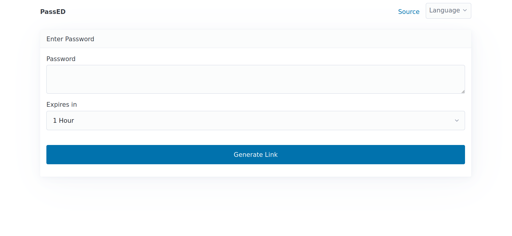

<!--
To README zostało automatycznie wygenerowane przez <https://github.com/YunoHost/apps/tree/master/tools/readme_generator>
Nie powinno być ono edytowane ręcznie.
-->

# PassED dla YunoHost

[](https://ci-apps.yunohost.org/ci/apps/passed/)


[](https://install-app.yunohost.org/?app=passed)

*[Przeczytaj plik README w innym języku.](./ALL_README.md)*

> *Ta aplikacja pozwala na szybką i prostą instalację PassED na serwerze YunoHost.*  
> *Jeżeli nie masz YunoHost zapoznaj się z [poradnikiem](https://yunohost.org/install) instalacji.*

## Przegląd

Share a password with someone securely by generating single-use URLs so that it doesn't get logged in a mailbox, shown in a messenger app's notification, etc. 

The password is contained in the URL itself as an encrypted string whereas the decryption key stored on the server is deleted after first use or selected timeframe. 


**Dostarczona wersja:** 2024.12.29~ynh1

## Zrzuty ekranu



## Dokumentacja i zasoby

- Oficjalna dokumentacja: <https://git.1e99.eu/1e99/passed/src/branch/main/README.md#how-it-works>
- Repozytorium z kodem źródłowym: <https://git.1e99.eu/1e99/passed>
- Sklep YunoHost: <https://apps.yunohost.org/app/passed>
- Zgłaszanie błędów: <https://github.com/YunoHost-Apps/passed_ynh/issues>

## Informacje od twórców

Wyślij swój pull request do [gałęzi `testing`](https://github.com/YunoHost-Apps/passed_ynh/tree/testing).

Aby wypróbować gałąź `testing` postępuj zgodnie z instrukcjami:

```bash
sudo yunohost app install https://github.com/YunoHost-Apps/passed_ynh/tree/testing --debug
lub
sudo yunohost app upgrade passed -u https://github.com/YunoHost-Apps/passed_ynh/tree/testing --debug
```

**Więcej informacji o tworzeniu paczek aplikacji:** <https://yunohost.org/packaging_apps>
