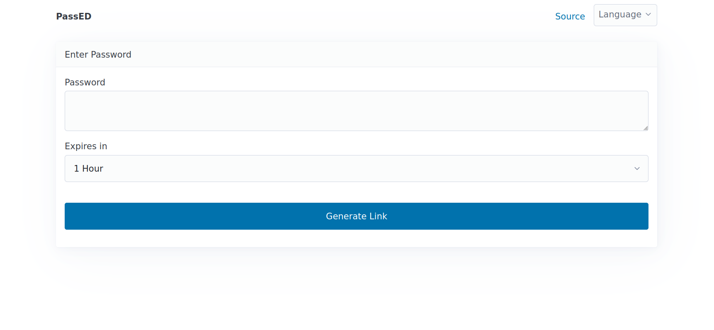

<!--
Важно: этот README был автоматически сгенерирован <https://github.com/YunoHost/apps/tree/master/tools/readme_generator>
Он НЕ ДОЛЖЕН редактироваться вручную.
-->

# PassED для YunoHost

[](https://ci-apps.yunohost.org/ci/apps/passed/)


[](https://install-app.yunohost.org/?app=passed)

*[Прочтите этот README на других языках.](./ALL_README.md)*

> *Этот пакет позволяет Вам установить PassED быстро и просто на YunoHost-сервер.*  
> *Если у Вас нет YunoHost, пожалуйста, посмотрите [инструкцию](https://yunohost.org/install), чтобы узнать, как установить его.*

## Обзор

Share a password with someone securely by generating single-use URLs so that it doesn't get logged in a mailbox, shown in a messenger app's notification, etc. 

The password is contained in the URL itself as an encrypted string whereas the decryption key stored on the server is deleted after first use or selected timeframe. 


**Поставляемая версия:** 2024.12.29~ynh1

## Снимки экрана



## Документация и ресурсы

- Официальная документация пользователя: <https://git.1e99.eu/1e99/passed/src/branch/main/README.md#how-it-works>
- Репозиторий кода главной ветки приложения: <https://git.1e99.eu/1e99/passed>
- Магазин YunoHost: <https://apps.yunohost.org/app/passed>
- Сообщите об ошибке: <https://github.com/YunoHost-Apps/passed_ynh/issues>

## Информация для разработчиков

Пришлите Ваш запрос на слияние в [ветку `testing`](https://github.com/YunoHost-Apps/passed_ynh/tree/testing).

Чтобы попробовать ветку `testing`, пожалуйста, сделайте что-то вроде этого:

```bash
sudo yunohost app install https://github.com/YunoHost-Apps/passed_ynh/tree/testing --debug
или
sudo yunohost app upgrade passed -u https://github.com/YunoHost-Apps/passed_ynh/tree/testing --debug
```

**Больше информации о пакетировании приложений:** <https://yunohost.org/packaging_apps>
